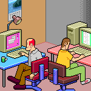

  

# Привет! Я Константин 👋

✨ Добро пожаловать на мою страницу GitHub! ✨

---

## Обо мне 📍

Меня зовут Константин, мне 29 лет, и я из прекрасного города Казань.

---

## Образование 📚🎓

* Окончил **Казанский кооперативный институт** в 2021 году. ✅
* Сейчас активно учусь и улучшаю свои навыки кодинга в **Школе 21** с 2023 года. 🌱
* Регулярно решаю задачки на **LeetCode** для оттачивания алгоритмических навыков. 🧠
---

## Мои Увлечения и Интересы 🔥🗺️🎮

* В свободное время очень люблю **путешествовать** ✈️ и увлекаюсь **активными видами спорта** 🚴⛰️. **Туризм, походы, велосипед** – это помогает мне сохранять высокий уровень энергии и работоспособность 💪.
* Увлекаюсь **компьютерными играми** 🎮, но еще больше увлечен процессом их **создания** 💻.

---

## Мой Технический Стек 💾

---

## Связь со мной 👇

  
  

